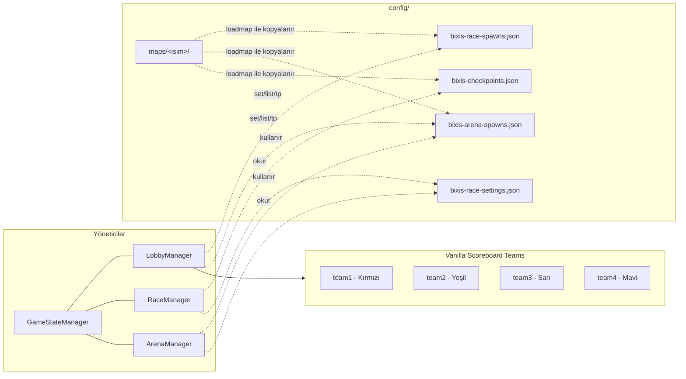
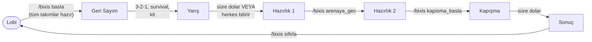
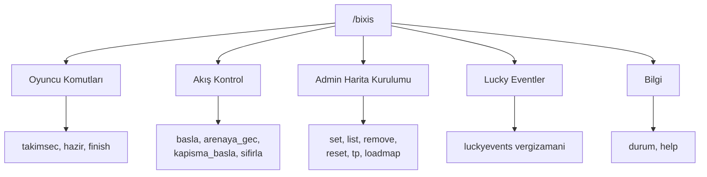
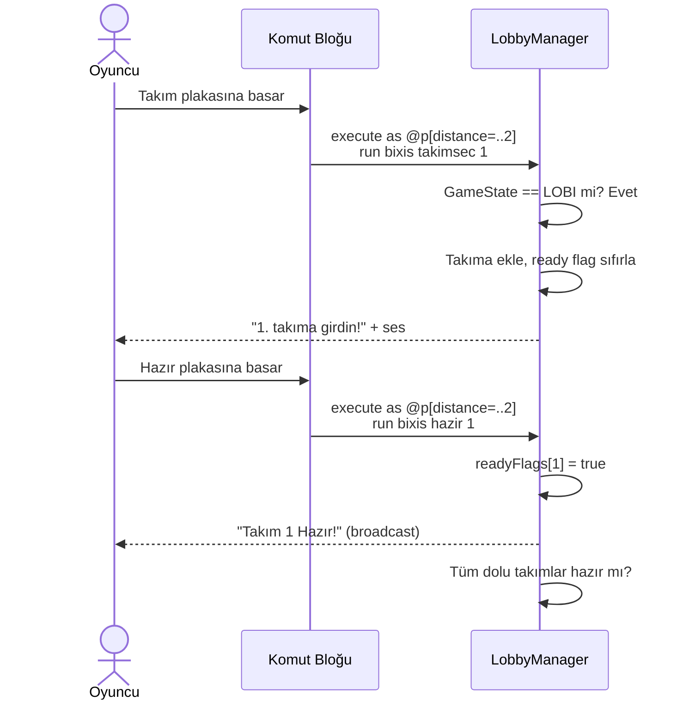
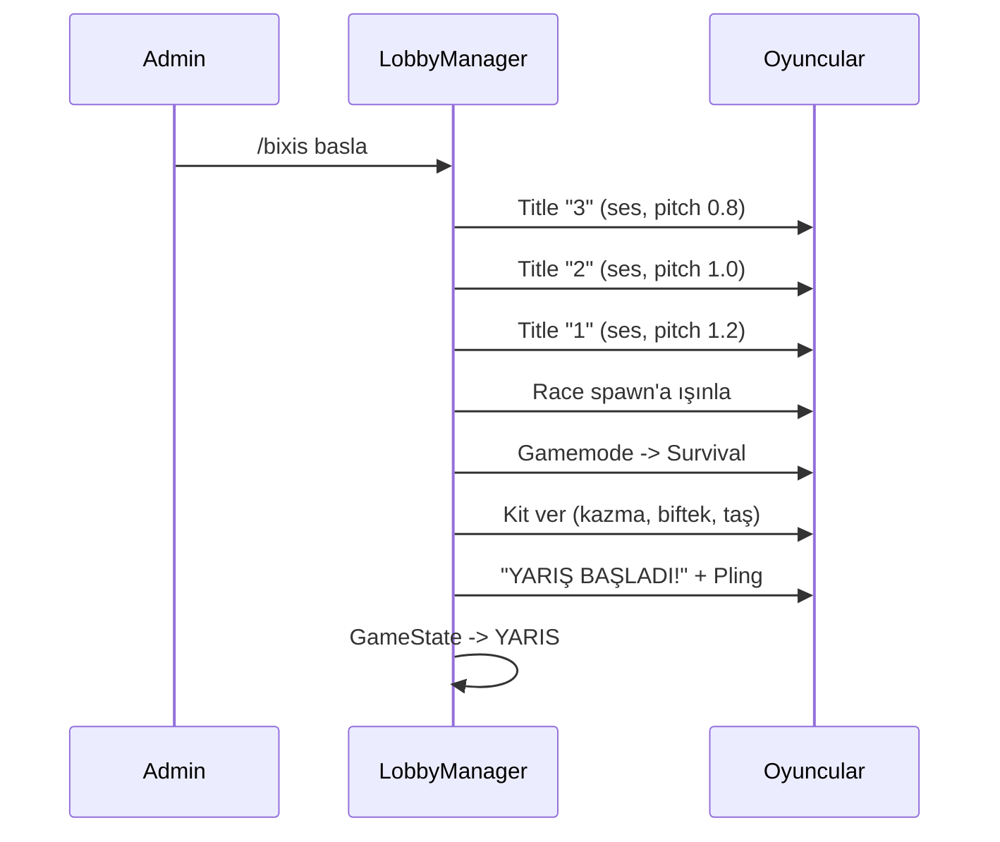
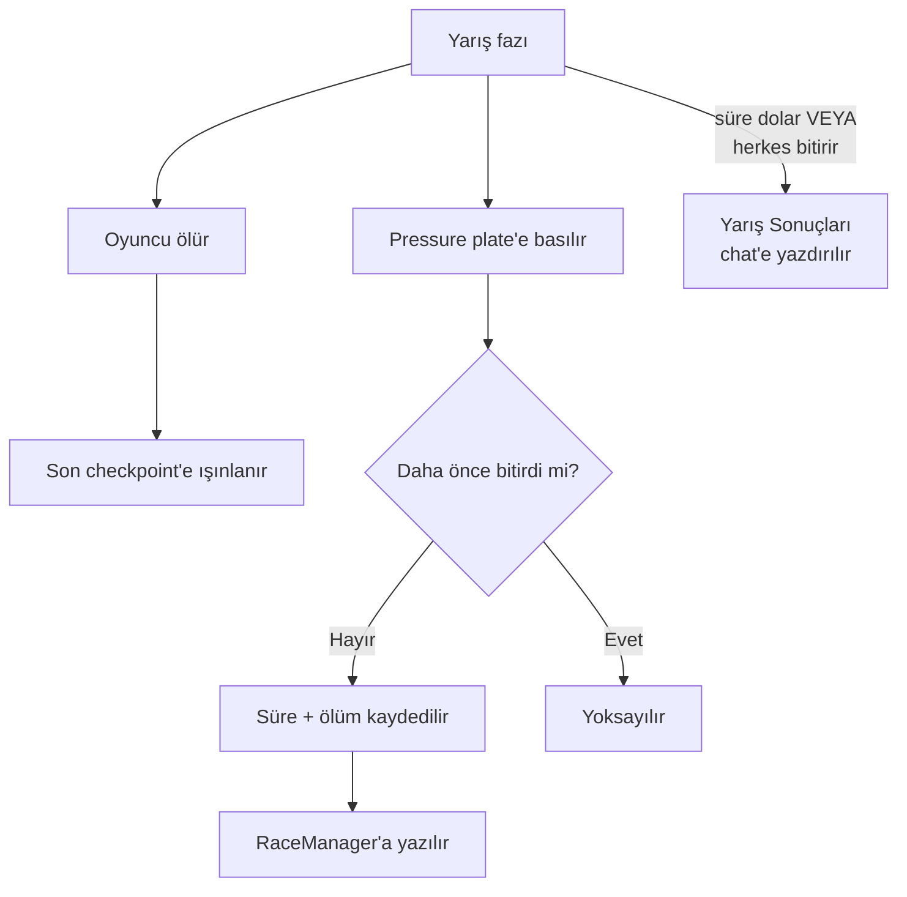
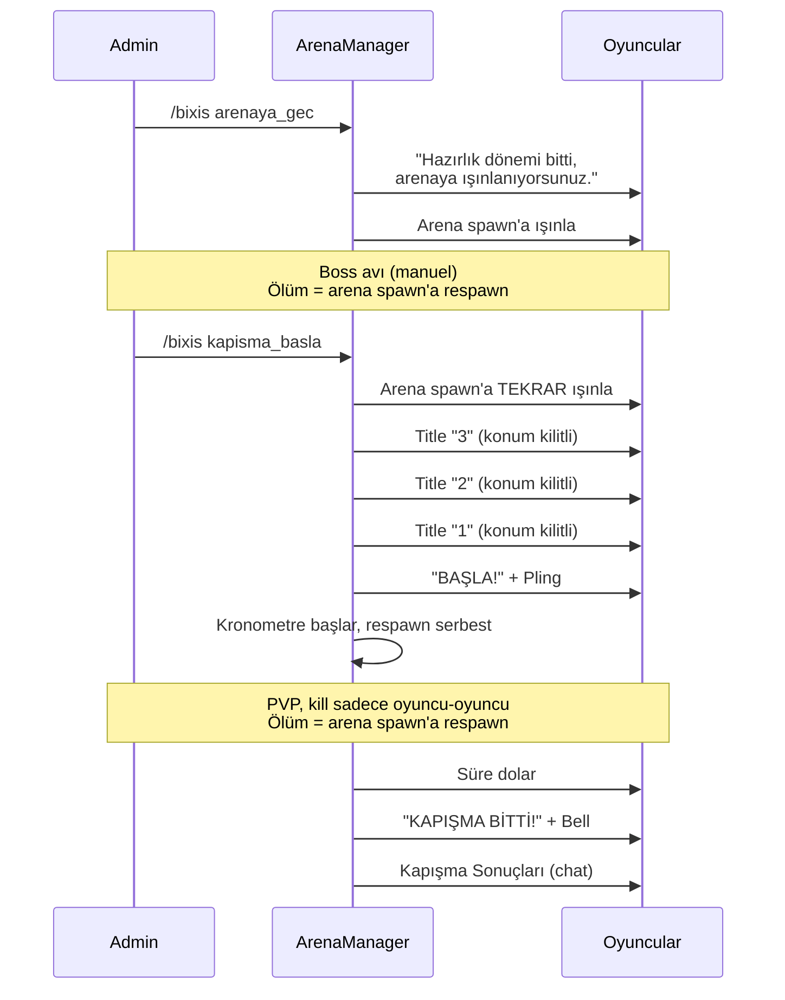

# Bixis Minigame Sistemi — v1.0.1 Tasarım & Mimari Dokümanı

> **Durum: v1.0.1 implement edildi.** Bu doküman hem orijinal beyin
> fırtınasını hem de implementasyon sırasında netleşen/değişen
> kararları yansıtır. Tüm diyagramlar Mermaid formatında — GitHub
> bunları otomatik render eder, ek bir araç gerekmez.

---

## 1. Genel Bakış

Lucky Block race formatı (4 kişi yarışır → şans bloklarından TL
toplar → shop'tan item alır → arenada dövüşür) bir minigame state
machine'e bağlandı. Tekrarlayan teknik iş (geri sayım, ışınlama, kit
dağıtımı, süre takibi, sonuç hesaplama) otomatikleşti. Yaratıcı/değişken
kısımlar (boss seçimi, isimlendirme, PVP'nin kazananı) bilinçli olarak
manuel bırakıldı.

---

## 2. Mimari Genel Bakış

Dört yönetici sınıf, ortak bir `GameStateManager` etrafında çalışır.
Her biri kendi fazından sorumlu, config dosyalarını okur/yazar:



- **GameStateManager** — tek doğruluk kaynağı, mevcut `GameState`'i tutar
- **LobbyManager** — Lobi + Geri Sayım fazları, takım/ready/sidebar
- **RaceManager** — Yarış fazı, checkpoint/ölüm/bitiş çizgisi/sonuç
- **ArenaManager** — Hazırlık 2 + Kapışma + Sonuç fazları

---

## 3. Oyun Durumları (State Machine)

7 durum, doğrusal bir döngü oluşturur:



| Durum | Giriş tetikleyici | Çıkış tetikleyici | Süre sınırı |
|---|---|---|---|
| **Lobi** | Sunucu açılışı / `/bixis sifirla` | Tüm dolu takımlar hazır + admin `/bixis basla` | Yok |
| **Geri Sayım** | `/bixis basla` | Kit dağıtımı tamamlanınca otomatik | ~5 sn (sabit) |
| **Yarış** | Geri sayım bitince otomatik | Süre dolunca OTOMATİK, ya da tüm dolu takımların tüm üyeleri bitirince ERKEN | `set racetime` ile ayarlanabilir (varsayılan 15 dk) |
| **Hazırlık 1** | Yarış bitince otomatik | Admin `/bixis arenaya_gec` | Yok |
| **Hazırlık 2** | `/bixis arenaya_gec` | Admin `/bixis kapisma_basla` | Yok |
| **Kapışma** | `/bixis kapisma_basla` | Süre dolunca otomatik | `set pvptime` ile ayarlanabilir (varsayılan 3 dk) |
| **Sonuç** | Kapışma süresi dolunca otomatik | Admin `/bixis sifirla` | Yok |

---

## 4. Komut Mimarisi



Tam liste için Bölüm 6'ya bakınız.

---

## 5. Faz Detayları

### 5.1 Lobi

Oyuncular `/bixis takimsec <1-4>` ile takım seçer, `/bixis hazir <1-4>`
ile hazır olduklarını bildirir. Takım üyeliği her değiştiğinde o
takımın ready flag'i otomatik `false`'a döner.

**Command block uyumluluğu:** Komutlar `execute as <selector> run ...`
kalıbıyla çağrılmalı — direkt `/bixis takimsec 1` yazmak command
block'u "oyuncu" olarak değil "command block entity"si olarak
çalıştırır ve reddedilir. Doğru kullanım, oyuncuyu konuma göre
filtreleyerek:



`distance=..2` filtresi, komut bloğuna gerçekten yaklaşmış olan
oyuncuyu garanti eder — birden fazla kişi aynı anda yakın dururlarsa
karışıklık önlenir.

**Takım renkleri:**

| Takım | Renk | Format kodu |
|---|---|---|
| 1 | Kırmızı | `&c` |
| 2 | Yeşil | `&a` |
| 3 | Sarı | `&e` |
| 4 | Mavi | `&9` |

**Hata mesajları:** `&4` (Dark Red) + ⚠ ile takım renklerinden ayrılır,
böylece Takım 1'in `&c` rengiyle karışmaz.

**Sidebar:** Lobi fazındayken canlı güncellenen bir scoreboard, her
takımın oyuncu sayısını ve hazır durumunu (✔/✘ ikonları) gösterir.

### 5.2 Geri Sayım



**Kit içeriği:** 1x demir kazma, 10x pişmiş biftek, 32x taş.

### 5.3 Yarış



- `keepInventory` gamerule'a **mod dokunmaz** — manuel olarak true
  tutulması bekleniyor, oyunun tamamında geçerli.
- Bitiş çizgisi pressure plate altına komut bloğu ile bağlanır:
  `execute as @p[distance=..1] run bixis finish`
- Erken bitiş: süre dolmadan tüm dolu takımların tüm üyeleri finish
  ederse Hazırlık 1'e hemen geçilir.

**Chat formatı (Sonuç fazına geçişte):**
```
─── Yarış Sonuçları ───
[Oyuncu] - mm:ss.ms - N Ölüm
[Oyuncu] - Bitirmedi - N Ölüm
```

### 5.4 Hazırlık 1 — Race Map

Süre sınırı yok. Shop (Villa Hakan), envanter düzeni, mola.

### 5.5 Hazırlık 2 — Arena

### 5.6 Kapışma — PVP

### 5.7 Sonuç



**Hazırlık 2 ve Kapışma — tek arena:** Boss arena ile PVP arena
**aynı fiziksel mekan**. Her takım kendi köşesinde başlar, sonra
toplanır. Ayrı bir "boss arena" / "PVP arena" ayrımı yok.

**Konum kilitleme (anti-bypass):** Kapışma geri sayımında Slowness
efekti **kullanılmaz** — koşu+zıplama ile bypass edilebiliyordu.
Bunun yerine her tick oyuncu countdown başındaki pozisyona zorla
sabitlenir (teleport), sadece bakış açısı serbest kalır.

**Respawn (Hazırlık 2 ve Kapışma ortak):** Ölen oyuncu vanilla
respawn yerine kendi takımının arena spawn noktasına ışınlanır.

**Kill sayacı:** Sadece oyuncu-oyuncu öldürmeleri sayılır — mob
öldürmek kill'e katkı sağlamaz (`event.getEntity() instanceof
ServerPlayer` VE `event.getSource().getEntity() instanceof
ServerPlayer` ikisi de kontrol edilir). Death sayacı her ölümde artar
(mobdan ölse bile).

**Chat formatı:**
```
─── Kapışma Sonuçları ───
[Oyuncu]: N Öldürme / N Ölüm
```

Kazanan otomatik hesaplanmaz — format açık uçlu, izleyici yorumlarda
seçer.

---

## 6. Komut Referansı

### 6.1 Oyuncu komutları

| Komut | Açıklama | Hangi fazda |
|---|---|---|
| `/bixis takimsec <1-4>` | Takıma atar, eski takımdan çıkarır, her iki takımın ready flag'ini sıfırlar | Lobi |
| `/bixis hazir <1-4>` | Ready flag'i true yapar, takım renginde broadcast | Lobi |
| `/bixis finish` | Bitiş çizgisinde tetiklenir (pressure plate + command block) | Yarış |

### 6.2 Akış kontrol komutları

| Komut | Açıklama | Ön koşul |
|---|---|---|
| `/bixis basla` | Lobi → Geri Sayım | Tüm dolu takımlar hazır olmalı |
| `/bixis arenaya_gec` | Hazırlık 1 → Hazırlık 2, ışınlama | Yok |
| `/bixis kapisma_basla` | Hazırlık 2 → Kapışma, konum kilitli countdown | Yok |
| `/bixis sifirla` | Her şeyi Lobi durumuna resetler | Herhangi bir durumda |

> **Not:** Orijinal tasarımda yer alan genel amaçlı `/bixis bitir`
> (mevcut fazı zorla bitirme) implement edilmedi — yerini daha
> spesifik geçiş komutları (`arenaya_gec`, `kapisma_basla`,
> `sifirla`) aldı.

### 6.3 Admin harita kurulum komutları

| Komut | Açıklama |
|---|---|
| `/bixis admin set race <1-4>` | Yarış başlangıç noktasını (konum+yön+dimension) kaydeder |
| `/bixis admin set arena <1-4>` | Arena/PVP spawn noktasını kaydeder |
| `/bixis admin set checkpoint <1-4>` | Yeni checkpoint ekler (otomatik sıra numarası) |
| `/bixis admin set racetime <dakika>` | Yarış fazı süresini ayarlar (varsayılan 15) |
| `/bixis admin set pvptime <dakika>` | Kapışma fazı süresini ayarlar (varsayılan 3) |
| `/bixis admin list race \| arena \| checkpoint <1-4>` | Kayıtlı noktaları chat'e döker |
| `/bixis admin remove checkpoint <1-4> <sira>` | Checkpoint siler, sıra numaralarını kaydırır |
| `/bixis admin reset all` | Tüm harita kayıtlarını siler |
| `/bixis admin tp race \| arena \| checkpoint <1-4> [sira]` | Test amaçlı ışınlanma |
| `/bixis admin loadmap <isim>` | `config/maps/<isim>/` klasöründen aktif config'e kopyalar |

### 6.4 Lucky event komutları

| Komut | Açıklama |
|---|---|
| `/bixis luckyevents vergizamani` | Tüm oyunculardan 5-25 TL siler, title + Bell sesi |

> Genişletilebilir yapıda kuruldu — yeni event komutları (örn.
> `parayagmuru`) aynı `luckyevents` altına eklenebilir.
> **Önemli:** Bu, eski `/bixis vergizamani`'nin yerini aldı.
> Addon'lardaki `drops.txt` dosyaları güncellenmeli (Mehmet Şimşek
> teması güncellendi, diğer addon'lar kontrol edilmeli).

### 6.5 Bilgi komutları

| Komut | Açıklama |
|---|---|
| `/bixis durum` | Mevcut GameState'i chat'e yazar |
| `/bixis help` | Tüm komutları kategorilere ayırarak listeler |
| `/bixis ping` | Mod aktif mi test eder (v1.0.0'dan kalma) |

---

## 7. Veri Mimarisi

| Veri | Saklama yöntemi |
|---|---|
| Takım üyeliği, renk, isim | Vanilla Scoreboard Team API |
| Ready flag (takım başına) | `GameStateManager`/`LobbyManager` içinde bellekte |
| Race/arena/checkpoint koordinatları | `config/bixis-*.json` (her video için yeniden doldurulur) |
| Yarış/Kapışma süreleri | `config/bixis-race-settings.json` |
| Yarış süresi + ölüm sayısı | `RaceManager` içinde bellekte, Sonuç fazında chat'e yazdırılır |
| Mevcut oyun durumu | `GameStateManager`, bellekte (kalıcı değil, sunucu yeniden başlayınca sıfırlanır) |

Mimari diyagram için bkz. Bölüm 2.

---

## 8. Kararlar

Tüm açık kararlar netleşti ve implement edildi:

- **Ready flag reset:** Takım üyeliği değişince ilgili takımın ready
  flag'i otomatik `false`'a döner.
- **Lobi sidebar:** Canlı güncellenen tablo, ✔/✘ ikonlarıyla.
- **Kapışma kill/death:** Sadece oyuncu-oyuncu öldürmeleri sayılır.
- **Takım renkleri:** Kırmızı/Yeşil/Sarı/Mavi (`&c`/`&a`/`&e`/`&9`).
- **Boss seçimi/isimlendirmesi:** Tamamen manuel kalır.
- **Kapışma kazananı:** Otomatik hesaplanmaz, izleyici seçer.
- **Tek arena:** Boss avı ve PVP aynı fiziksel mekanda.
- **Konum kilitleme:** Slowness değil, zorla teleport (anti-bypass).

---

## 9. Bilinen Sınırlamalar / Sonraki Adımlar

**Doğrulanması gereken:**
- `/bixis admin loadmap` çok oyunculu/gerçek senaryoda tam test
  edilmedi (tek kişilik testte mantık doğrulandı, dosya kopyalama
  akışı net değil).

**1.0.1 sonrası (1.0.2 adayı):**
- `/bixis help` çıktısına her komutun yanına kısa açıklama eklenmesi
- Sound tablosunun geri kalan kısımlarının (gerekirse) ince ayarı
